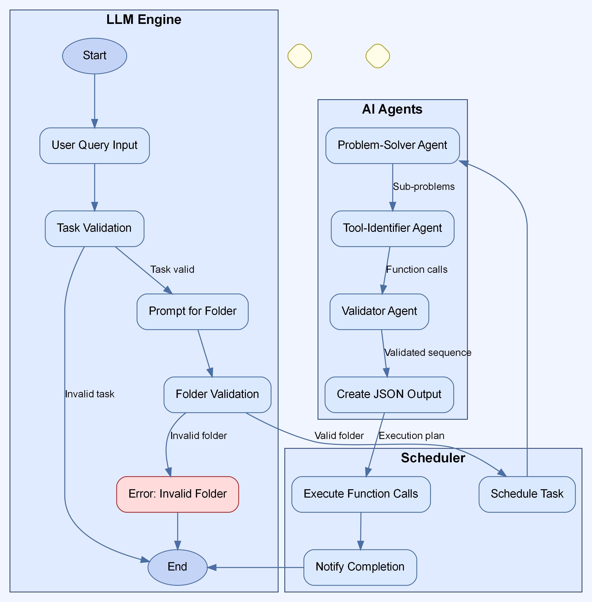

# Intelligent File Management & Task Automation Agent

## Overview

This enterprise-grade application implements an intelligent agent powered by Google's Gemini-2.0-flash-exp model to automate file management workflows and execute scheduled tasks based on natural language instructions. The system provides a comprehensive solution for file organization, media compression, and task automation, significantly reducing manual overhead for routine file management tasks.

## How It Works

The system operates through a three-component architecture:

1. **LLM Engine (User Interface)**
   - Handles user interaction and query processing
   - Validates task compatibility with system capabilities
   - Manages input/output communication

2. **Task Scheduler**
   - Orchestrates the execution pipeline
   - Manages the sequence of operations
   - Handles task timing and dependencies

3. **AI Agent Network**
   - **Problem-Solver Agent**: Breaks complex tasks into manageable steps
   - **Tool-Identifier Agent**: Maps tasks to appropriate system functions
   - **Validator Agent**: Ensures proper sequencing of operations

### Process Flow

1. User submits a natural language query describing their task
2. System validates whether the task falls within its capabilities
3. User is prompted to specify the target folder for processing
4. System validates folder existence and content
5. The query is sent to the scheduler for processing
6. Problem-Solver Agent breaks down the query into discrete steps
7. Tool-Identifier Agent determines required functions for each step
8. Validator Agent confirms proper function sequence
9. System executes the function sequence
10. Results and completion notification are provided to the user

## System Architecture Flowchart



*Architecture diagram showing the interaction between system components*

## Demo

[](https://youtube.com/watch?v=your_video_id)

*Click the image above to watch a demonstration of the system in action*

## Execution Screenshots

### User Query Processing


### Initial Data


### Execution_Result_1


### Execution Results


## Core Capabilities

### Automated File Organization

- Recursive directory scanning and analysis
- Intelligent file categorization based on type and content
- Metadata preservation during organization
- Customizable organization schemes and rules

### Media Compression Services

- **PDF Compression**:
  - Size reduction with document structure preservation
  - Configurable compression levels
  - Batch processing capabilities

- **Image Optimization**:
  - Support for PNG, JPG, and other common formats
  - Quality-size balancing algorithms
  - Metadata preservation

### Task Automation Framework

- Natural language instruction parsing from `todo.txt`
- Email communication for reminders and notifications
- Calendar operations (creating/modifying invitations)
- Financial data monitoring
- Extensible task architecture

## Installation

### Prerequisites

- Python 3.8+ (3.9+ recommended)
- Internet connection for API services
- SMTP access for email capabilities

### Setup Steps

1. **Clone the repository**:
   ```bash
   git clone https://github.com/yourusername/intelligent-file-agent.git
   cd intelligent-file-agent
   ```

2. **Create a virtual environment**:
   ```bash
   python -m venv venv
   source venv/bin/activate  # On Windows: venv\Scripts\activate
   ```

3. **Install dependencies**:
   ```bash
   pip install -r requirements.txt
   ```

4. **Configure environment**:
   Create a `.env` file with:
   ```
   # API Configuration
   GOOGLE_API_KEY=your_gemini_api_key_here

   # Email Configuration
   EMAIL_ADDRESS=your_email@example.com
   EMAIL_PASSWORD=your_app_specific_password
   SMTP_SERVER=smtp.example.com
   SMTP_PORT=587

   # File System Configuration
   DEFAULT_SCAN_PATH=/path/to/default/directory
   ORGANIZED_FILES_BASE=/path/to/organized/files

   # Task Configuration
   TODO_FILE_PATH=/path/to/todo.txt
   ```

5. **Create required directories**:
   ```bash
   mkdir -p logs organized_files/{Documents,Images,Audio,Video,Archives,Other} compressed_files/{PDFs,Images}
   ```

## Usage

### Basic Operation

Run the agent with default configuration:
```bash
python run_agent.py
```

### Custom Configuration

Specify custom paths and configurations:
```bash
python run_agent.py --scan_path /path/to/files --todo_file /path/to/custom_todo.txt --output_dir /path/to/output
```

### Scheduled Operation

Configure the agent to run on a schedule:
```bash
python schedule_agent.py --interval daily --time "18:00"
```

## Task Instruction Format

The system processes natural language instructions from a `todo.txt` file. Examples include:

### Email Reminders
```
Remind me to "Complete quarterly tax filing" via email on "2025-03-15 14:00"
```

### Calendar Management
```
Add a calendar invite for "Team Strategy Meeting" on "2025-03-20 13:00" and share it with "team@company.com"
```

### File Management
```
Scan and organize folder "Downloads" weekly
Compress all PDFs in "Documents/Reports" every "Monday" at "01:00"
```

## System Architecture

```
├── src/
│   ├── llm_engine/               # User interface and LLM integration
│   ├── file_organizer/           # File organization module
│   ├── file_compression/         # Compression implementation
│   └── execute_to_do_tasks/      # Task execution module
│
├── run_agent.py                  # Main execution entry point
├── schedule_agent.py             # Scheduling control interface
└── utility_functions.py          # Shared utility functions
```

## Error Handling and Logging

- Comprehensive logging with configurable levels
- Error notification system
- Retry mechanisms for failed operations

## Extending the System

The modular architecture allows for straightforward extension:

1. **Adding New Task Types**:
   - Create a new task handler in the `execute_to_do_tasks` directory
   - Register the task type in the task parser

2. **Supporting New File Types**:
   - Add detection logic to the file organizer
   - Create appropriate category handlers

## Troubleshooting

Common issues and their resolutions:

1. **API Connection Failures**:
   - Verify API keys in `.env` file
   - Check network connectivity

2. **Email Delivery Issues**:
   - Verify SMTP settings
   - Check email credentials

3. **File Access Errors**:
   - Verify directory permissions
   - Check for file locks from other applications

## License

This project is licensed under the MIT License - see the LICENSE file for details.